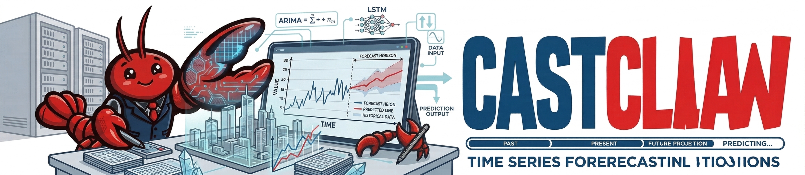

# CastClaw




[主页](https://agentr1.github.io/cast-claw/index.html) · [GitHub 仓库](https://github.com/SkyeGT/CastClaw) · [English](./README.md) · 中文

**自主化。多智能体。全交互式。**

丢入一个 CSV 文件，描述你想要的预测目标——CastClaw 会自动调度三个专属智能体协同工作：定义任务、并行运行模型实验、生成对比分析报告。内置的反思机制让系统在每次会话后持续学习，越用越聪明。

  

## 🗞️ 最新动态

**[2026-03-31]** CastClaw 正式开源，附完整文档与多 LLM 提供商支持。

## CastClaw 有何不同

🗂️ **先规划，再执行**  
在运行任何模型之前，CastClaw 会先起草一份逐步预测计划并展示给你。你可以重新排序步骤、添加领域约束，确认后再执行——没有你的明确同意，不会有任何操作触碰你的数据。

📊 **并行运行多智能体**  
上传多张表格或提出对比分析问题，CastClaw 自动为每个数据集分配独立的 Forecaster 智能体，并行运行后再汇总结论——明确标注哪些预测达成共识（[CONSENSUS]），哪些存在分歧（[UNCERTAIN]）。

🤖 **三大专属智能体协同配合**

- **Planner（规划者）** — 定义任务、分析数据趋势与季节性、生成模型推荐方案  
- **Forecaster（预测者）** — 并行运行 30+ 个时序模型，每轮实验后进行反思  
- **Critic（评审者）** — 对比结果、构建交互可视化、提炼最终报告

🧠 **每次会话都在学习**  
每次预测任务结束后，CastClaw 会对有效方法进行反思，并将其编码为可复用的自定义技能。下次遇到类似问题，系统会直接调用该技能——你的专属预测助手越来越懂你。

💾 **记住你的偏好**  
跨会话记录你的领域术语、偏好指标、输出格式和评估优先级。每次对话都建立在以往积累的认知之上。

🛠️ **支持自定义技能扩展**  
自己编写技能——提示模板或嵌入 Python/SQL 逻辑——智能体会像调用内置技能一样调用它们。结合会话学习，CastClaw 会逐渐构建出专属你工作流的技能库。

📦 **管理完整实验生命周期**  
从自动化数据预处理 → 并行模型训练 → 指标评估 → 约束满足验证 → 可视化报告生成，全流程追踪：运行日志、评估指标、失败历史和性能对比，一览无余。

⏸️ **人机协作（HITL）实时介入**  
实验过程中随时暂停并注入领域知识：*"最近 30 天看起来过拟合了，试试缩小回看窗口。"* Forecaster 会将你的输入记录为专家反馈，重置计数器并在下一轮实验中相应调整——告别黑盒式全自动。

## 快速开始


**npm 全局安装（推荐）**

```bash
npm install -g castclaw
```


**验证安装**

```bash
castclaw --version
```

**配置 LLM**

```bash
# Anthropic
export ANTHROPIC_API_KEY=sk-ant-...

# 或 OpenAI / Google / OpenRouter
export OPENAI_API_KEY=sk-...
export GOOGLE_GENERATIVE_AI_API_KEY=...
```

在项目根目录创建 `castclaw.json`（示例）：

```json
{
  "model": "anthropic/claude-sonnet-4-6"
}
```

**开始预测**

```bash
# 进入数据集所在目录，启动 TUI
cd /path/to/your/dataset
castclaw

# 或指定模型
castclaw --model anthropic/claude-sonnet-4-6
```

TUI 启动后，用 `Ctrl+1/2/3` 切换代理；在 **Planner** 标签页（`Ctrl+1`）中输入任务描述，例如：

```
为 data/etth1.csv 初始化预测会话。目标列：OT，时间列：date，
预测步长：96 步，回看长度：336。采用 70/20/10 分割，使用 MSE 和 MAE 评估。
```

示例数据集（`datasets.zip`）可从 [Google Drive](https://drive.google.com/file/d/1HOCE20FQgLl0xCv_dOmLcTbN1RCZWwqd/view?usp=drive_link) 下载

## 📋 环境要求


| 依赖 | 版本 | 说明 |
| -------------------------------- | --------- | --------------------------------- |
| [Bun](https://bun.sh) | ≥ 1.3.11 | 运行时与包管理器 |
| [Python](https://python.org) | ≥ 3.10 | 时序模型 ML 后端 |
| [uv](https://docs.astral.sh/uv/) | 最新版 | Python 依赖管理 |
| GPU（可选） | CUDA 12.8 | 深度学习模型加速 |
| 昇腾 NPU（可选） | Atlas 800 A2/A3【Ascend HDK 25.5.1】 | 华为昇腾上的深度学习加速 |


## 🤖 支持模型（30+）

**统计模型：** ARIMA、ETS、Theta  
**深度学习：** DLinear、NLinear、PatchTST、TimesNet、iTransformer、Autoformer 等  
**基础模型：** Chronos（亚马逊）、TimesFM（谷歌）、Moirai（Salesforce）

## 🔧 配置

在项目根目录创建 `castclaw.json`：

```jsonc
{
  "model": "anthropic/claude-sonnet-4-6",
  "skills": {
    "paths": ["~/.my-skills/"]
  }
}
```

**LLM 提供商：** 通过 Vercel AI SDK 支持 20+ 个提供商（Anthropic、OpenAI、Google、OpenRouter 等）。请为所用提供商设置环境变量，例如：

```bash
export ANTHROPIC_API_KEY=sk-ant-...
# 或：OPENAI_API_KEY、GOOGLE_GENERATIVE_AI_API_KEY、OpenRouter 等
```

## 🎯 五阶段工作流

```
阶段一（Planner）    → 任务定义与数据接入
        ↓
阶段二（Planner）    → 定性 & 定量预测前分析
        ↓
阶段三（Planner）    → 模型技能生成与审核
        ↓
阶段四（Forecaster） → 并行实验循环 + 人机协作（HITL）反馈
        ↓
阶段五（Critic）     → 最终报告、可视化、对比分析
```

## 📚 文档

- **[English usage guide](./docs/en/usage.md)** — 安装、工作流、配置、LLM 提供商  
- **[中文使用指南](./docs/zh/usage.md)** — 与英文版结构一致：安装、工作流、配置、LLM  
- **[提交 Issue](https://github.com/SkyeGT/CastClaw/issues)** — GitHub Issues

## 📂 仓库结构

```
CastClaw/
├── packages/castclaw/    # TUI & CLI 核心
├── packages/app/         # 浏览器 Web 界面
├── packages/sdk/         # SDK 与运行时
├── python/               # ML 后端（30+ 个模型）
├── docs/                 # 使用文档
└── infra/                # 基础设施（SST）
```

## 🏆 核心优势对比


| 特性 | CastClaw | 传统工具 |
| ----------------------- | ---------------------------------- | --------------------- |
| 实验前规划 | ✅ 执行前展示方案 | ❌ 立即执行 |
| 多表并行分析 | ✅ 自动为每表分配智能体 | ❌ 顺序处理 |
| 会话学习 | ✅ 从交互中提炼技能 | ❌ 无状态 |
| 人机协作 | ✅ 随时暂停注入领域知识 | ❌ 全自动黑盒 |
| 约束管理 | ✅ CAST.md 定义规则与限制 | ❌ 需手动强制执行 |


## 🤝 参与贡献

欢迎贡献！请在 [GitHub](https://github.com/SkyeGT/CastClaw) 提交 Issue 或 Pull Request。

## 📄 许可证

MIT License — 详见 [LICENSE](./LICENSE)

## 📫 联系方式

- **问题与反馈：** [GitHub Issues](https://github.com/SkyeGT/CastClaw/issues)
- **文档：** [English](./docs/en/usage.md) · [中文](./docs/zh/usage.md)
- **微信：**

## 致谢

本项目得到了**中国科学技术大学**与**华为 2012 应用场景创新实验室**校企合作基金的鼎力支持；同时，研发过程中所需的计算资源由**华为昇腾 AI 百校计划**全力保障。

---
**由 CastClaw 团队用心打造 ❤️**
